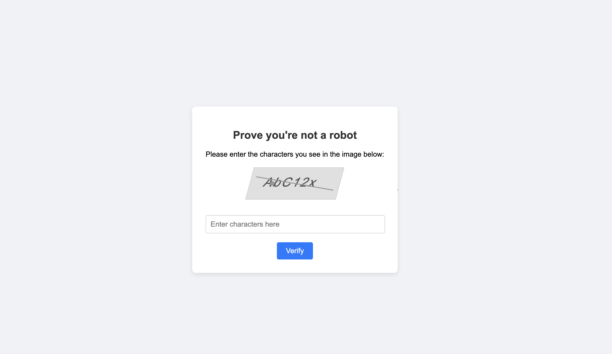
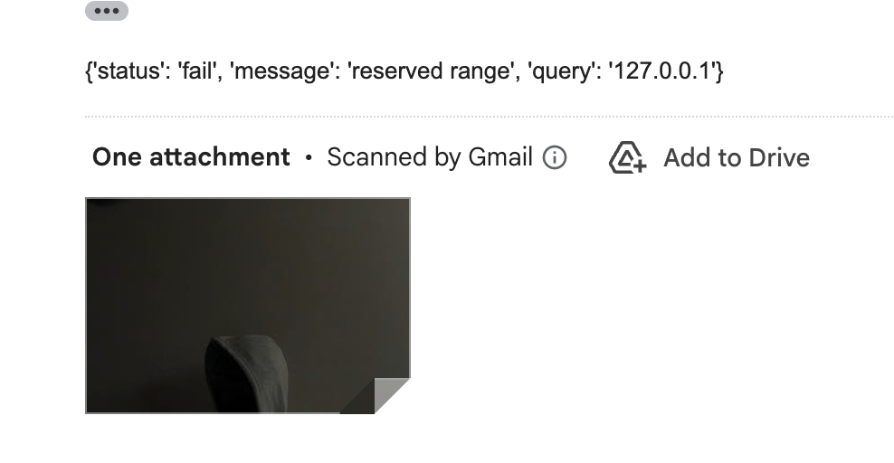

# Scam with Scammers 

### This project was inspired to catch scammers location and face photo inspired from an following article :  
https://www.instagram.com/p/DR1ggZRjd_C/?img_index=5&igsh=MWl6eWFkcGM0bGt1Nw==

- once the person clicks the link , it the browser will ask for a permision camera and show a spoofed kapcha website . it will directly send the ip + camera photo + location of the person to the specified mail . 
- any one with the intetion to catch the scammer can try to host it directly and share the link .

- 

- Mail the image and details : 
- 

